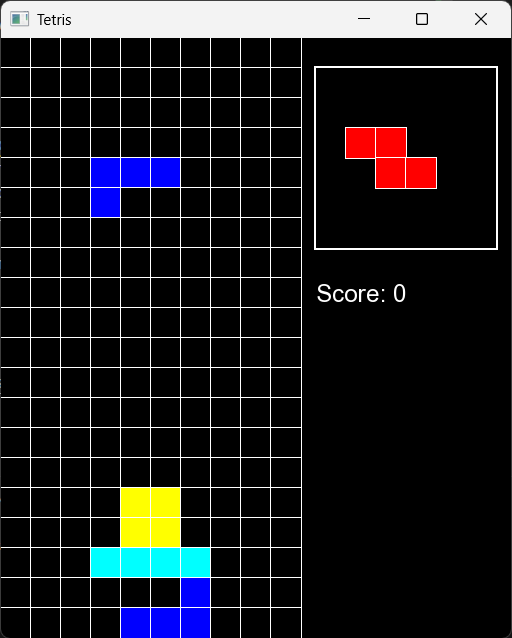

# Tetris
Tetris is a classic tile-matching puzzle game implemented in C++ using the SFML (Simple and Fast Multimedia Library) for graphics and input handling. This project is structured with CMake for easy building and portability. The game features real-time gameplay, smooth block movement, line clearing, and score tracking.


# Tetris in C++ (SFML 3)

A classic Tetris clone built using **C++** and **SFML 3**.

---

## Requirements
- **C++17** or later
- [SFML 3](https://www.sfml-dev.org/) (built and linked to your project)
- CMake

---

## Gameplay
- Use **Left/Right Arrow Keys** to move the piece.
- Use **Up Arrow** to rotate the piece.
- Use **Down Arrow** to drop the piece faster.
- Complete a line to score points — multiple lines at once give bonus points.
- Game over occurs when pieces stack to the top.

---

## Sample Screenshot



---

## How to Build
```bash
git clone https://github.com/MaximilianIsidore/Tetris.git
cd Tetris

mkdir build
cd build
cmake ..
cmake --build .
# or Compile with your preferred method or CMake

